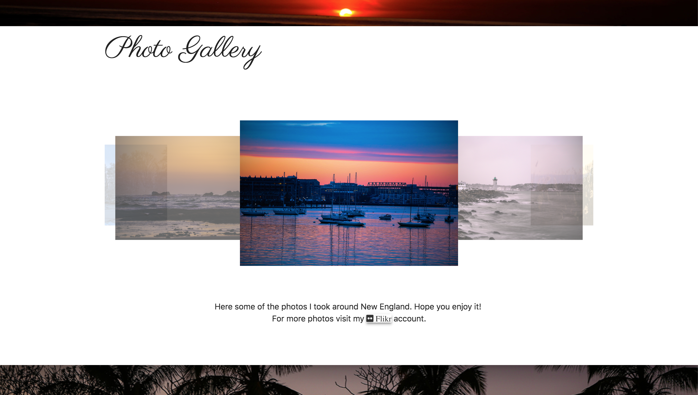

# Portfolio-Updated
Viktor Daniyelyan. Portfolio udated.

### Using parallaxes from Materilize CSS I was able to build this simple but good looking portfolio page.

## Also Mobile-Responsive!

## https://vitodaniel.github.io/Portfolio-Updated/.
